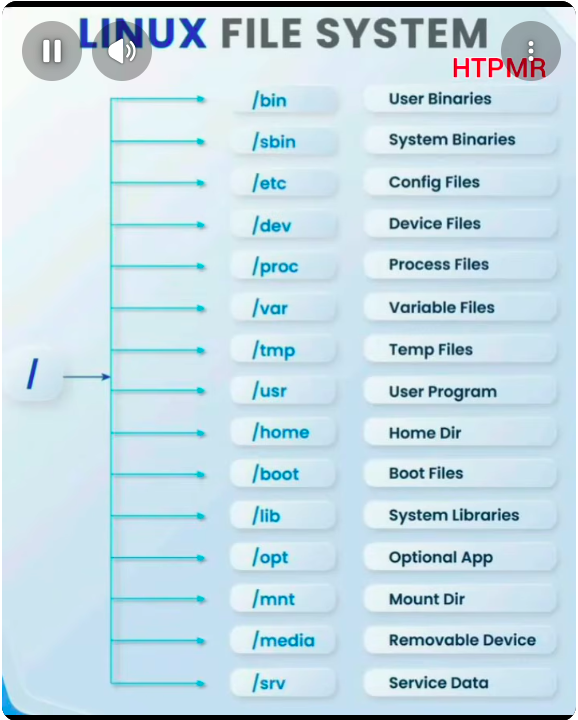

### Linux File System Notes

<table>
<tr>
<td width="45%" valign="top">
  
</td>

<td width="55%" valign="top">

      Linux      Purpose              Windows Equivalent
    ---------- -------------------- ----------------------------
    /        Root directory       C:\
    /bin     User commands        C:\Windows\System32
    /sbin    Admin commands       Admin tools
### /etc     Configuration        Registry + Config files
    /dev     Devices              Device Manager
    /proc    Process info         Task Manager
    /var     Logs, cache          ProgramData + Event Viewer
    /tmp     Temporary files      %TEMP%
    /usr     Installed programs   Program Files
    /home    User folders         Users
    /boot    Boot files           EFI/Boot partition
    /lib     Libraries            DLL files
    /opt     Optional apps        Program Files
    /mnt     Manual mount         Mounted drive
    /media   USB/CD               Removable drives
    /srv     Service data         inetpub/wwwroot

</td>
</tr>
</table>

## Remember

-   **/etc** → Configuration
-   **/home** → User files
-   **/var/log** → Logs
-   **/usr** → Programs
-   **/tmp** → Temp files
-   **/dev** → Devices
-   **/proc** → Process info
